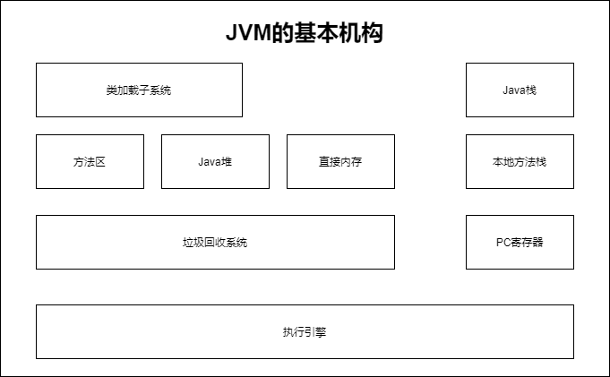

# 面试复盘第一篇
 [返回首页](../README.md)  
这是一家规模在15人左右的小公司。  
# 目录
- [数据库试题](#数据库试题)
    * [查询一节课程比另一节课程高的所有学生的学号](#查询一节课程比另一节课程高的所有学生的学号)
    * [查询平均成绩大于60分的同学的学号和平均成绩](#查询平均成绩大于60分的同学的学号和平均成绩)
    * [查询姓李的老师的个数](#查询姓李的老师的个数)
    * [查询各科成绩最高分和最低分](#查询各科成绩最高分和最低分)
    * [删除某学号同学的某科课程的成绩](#删除某学号同学的某科课程的成绩)
- [Java试题](#Java试题)
    * [什么是Java虚拟机](#什么是Java虚拟机)
    * [JDK和JRE的区别是什么](#JDK和JRE的区别是什么)
    * [static关键字是什么意思](#static关键字是什么意思)
    * [Java中是否可以覆盖一个private或者static的方法](#Java中是否可以覆盖一个private或者static的方法)
    * [Java支持的数据类型有哪些](#Java支持的数据类型有哪些)
    * [什么是自动拆装箱](#什么是自动拆装箱)
    * [Java方法中的方法覆盖与方法重载是什么意思](#Java方法中的方法覆盖与方法重载是什么意思)
    * [Java支持多继承么](#Java支持多继承么)
    * [接口和抽象类的区别是什么](#接口和抽象类的区别是什么)
    * [Spring与SpringMVC的工作原理](#Spring与SpringMVC的工作原理)
    * [Array和ArrayList有什么区别](#Array和ArrayList有什么区别)
    * [什么时候应该使用Array而不是ArrayList](#什么时候应该使用Array而不是ArrayList)
    * [ArrayList与LinkedList有什么区别](#ArrayList与LinkedList有什么区别)
    * [throw和throws有什么区别](#throw和throws有什么区别)
    * [finally代码块与finalize方法有什么区别](#finally代码块与finalize方法有什么区别)
    * [解释以下Servlet的生命周期](#解释以下Servlet的生命周期)
    * [什么是cookie](#什么是cookie)
    * [session和cookie有什么区别](#session和cookie有什么区别)
# 数据库试题
可以通过每个SQL代码块上的SQL超链接文本进入对应的sql文件。  
现有学生、课程、成绩、教师四张表。包含以下信息：  
1.学生表(STUDENT)  

| 字段名 | 注释 |  
| :-----:| :---: |  
| S_NO | 学号 |  
| S_NAME | 学生姓名 |
| S_AGE | 学生年龄 |  

2.课程表(COURSE)  

| 字段名 | 注释 |  
| :-----:| :---: |  
| C_NO | 课程编号 |
| C_NAME | 课程名称 |
| T_NO | 教师编号 |

3.成绩表(SC)  

| 字段名 | 注释 |  
| :-----:| :---: |  
| S_NO | 学号 |
| C_NO | 课程编号 |
| SCORE | 成绩 |

4.教师表(TEACHER)  

| 字段名 | 注释 |  
| :-----:| :---: |  
| T_NO | 教师编号 |
| T_NAME | 教师名字 |

## 查询一节课程比另一节课程高的所有学生的学号
    查询"111"课程比"112"课程成绩高的所有学生的学号。
一般来说有两种查询方法一种是用EXISTS的，一种是不用EXISTS的。  
**EXISTS**：用于鉴测子查询中是否至少返回一行数据，如果至少返回一行数据则返回True否则返回False。  
不用EXISTS的方法[SQL](sql/sql_1.sql):
```sql
SELECT
	a.S_NO 
FROM
	( SELECT * FROM SC WHERE C_NO = 111 ) a
	INNER JOIN 
	( SELECT * FROM SC WHERE C_NO = 112 ) b ON a.S_NO = b.S_NO 
WHERE
	a.SCORE > b.SCORE;
```
使用EXISTS的方法[SQL](sql/sql_2.sql):
```sql
SELECT
	t1.S_NO 
FROM
	SC t1 
WHERE
	t1.C_NO = 111 
	AND EXISTS (
SELECT
	1 
FROM
	SC t2 
WHERE
	t2.C_NO = 112 
	AND t1.S_NO = t2.S_NO 
	AND t1.SCORE > t2.SCORE 
	);
```
也许还有一种情况，比如SC表中有可能缺失数据比如

| S_NO | C_NO | SCORE |
| :-----:| :---: | :---: |  
| 1 | 111 | 110 |
| 1 | 112 | 90 |
| 2 | 111 | 90 |

这样2号学生就缺失了112科目的成绩，这样就有可能对查询造成影响。那么我们首先要使用STUDENT，COURSE，SC三张表将数据补全
将空的数据填补为0。
```sql
SELECT
	s.S_NO,
	c.C_NO,
	IFNULL( sc.SCORE, 0 ) AS SCORE 
FROM
	( STUDENT s, COURSE c )
	LEFT JOIN SC sc ON s.S_NO = sc.S_NO 
	AND sc.C_NO = c.C_NO 
GROUP BY
	s.S_NO,
	c.C_NO;
```

| S_NO | C_NO | SCORE |
| :-----:| :---: | :---: |  
| 1 | 111 | 110 |
| 1 | 112 | 90 |
| 2 | 111 | 90 |
| 2 | 112 | 0 |

然后在进行查询就是正确的结果，完整[SQL](sql/sql_3.sql):
```sql
SELECT
	t1.S_NO 
FROM
	(
  SELECT
	s.S_NO,
	c.C_NO,
	IFNULL( sc.SCORE, 0 ) AS SCORE 
  FROM
	  ( STUDENT s, COURSE c )
  LEFT JOIN SC sc ON s.S_NO = sc.S_NO 
	  AND sc.C_NO = c.C_NO 
  GROUP BY
	s.S_NO,
	c.C_NO 
	) t1 
WHERE
	t1.C_NO = 111 
	AND EXISTS (
          SELECT
	        1 
          FROM
	      (
            SELECT
	          s.S_NO,
	          c.C_NO,
	          IFNULL( sc.SCORE, 0 ) AS SCORE 
            FROM
	          ( STUDENT s, COURSE c )
	        LEFT JOIN SC sc ON s.S_NO = sc.S_NO 
	        AND sc.C_NO = c.C_NO 
            GROUP BY
	          s.S_NO,
	          c.C_NO 
	      ) t2 
          WHERE
	        t2.C_NO = 112 
	        AND t1.S_NO = t2.S_NO 
	        AND t1.SCORE > t2.SCORE 
	);
```
这个最后这个SQL是我的个人的理解感觉有很多可以优化的地方待改良，所以不建议生产环境下直接使用，请先进行效率测试。  
如果有测试结果或者优化建议希望能发评论或Issues大家一起讨论。
## 查询平均成绩大于60分的同学的学号和平均成绩
这个只要用GROUP BY对S_NO分组然后使用聚合函数AVG就可以得到结果了。  
[SQL](sql/sql_4.sql):
```sql
SELECT
	t1.S_NO,
	AVG( t1.SCORE ) AS AVG 
FROM
	SC t1 
GROUP BY
	t1.S_NO 
HAVING
	AVG( t1.SCORE ) > 60;
```
同样还是会存在上个问题时数据缺失的问题，如果缺失了一条数据求平均数的时候如果原本有4个科目会除以4，而缺失后会变成除以3。  
所以我们可以先使用子查询查询到科目的总数，然后除以SUM。  
获取科目的总数:
```sql
SELECT COUNT( 1 ) FROM COURSE
```
完整[SQL](sql/sql_5.sql):
```sql
SELECT
	s.S_NO,
	( SUM( s.SCORE ) / ( SELECT COUNT( 1 ) FROM COURSE ) ) AS AVG 
FROM
	SC s 
GROUP BY
	s.S_NO 
HAVING
	( SUM( s.SCORE ) / ( SELECT COUNT( 1 ) FROM COURSE ) ) > 60;
```
## 查询姓李的老师的个数
这个感觉没什么可说的，LIKE就完事了。  
[SQL](sql/sql_6.sql):
```sql
SELECT
	COUNT( 1 ) AS 数量 
FROM
	TEACHER T 
WHERE
	T.T_NAME LIKE '李%';
```
## 查询各科成绩最高分和最低分
    查询各科成绩最高分和最低分:以如下形式显示：课程ID，最高分，最低分。
首先还是不考虑数据缺失的情况，直接使用GROUP BY对C_NO进行分组然后使用MAX与MIN聚合函数。  
[SQL](sql/sql_7.sql):
```sql
SELECT
	t1.C_NO,
	MIN( t1.SCORE ) AS MIN_SCORE,
	MAX( t1.SCORE ) AS MAX_SCORE 
FROM
	SC t1 
GROUP BY
	t1.C_NO;
```
在面对数据缺失的情况还是像第一题一样先将数据补全然后在进行分组与聚合函数。  
[SQL](sql/sql_8.sql):
```sql
SELECT
	t.C_NO,
	MIN( t.SCORE ) AS MIN_SCORE,
	MAX( t.SCORE ) AS MAX_SCORE 
FROM
	(
    SELECT
	  s.S_NO,
	  c.C_NO,
	  IFNULL( sc.SCORE, 0 ) AS SCORE 
    FROM
	  ( STUDENT s, COURSE c )
	LEFT JOIN SC sc ON s.S_NO = sc.S_NO 
	                  AND sc.C_NO = c.C_NO 
    GROUP BY
	  s.S_NO,
	  c.C_NO 
	) t 
GROUP BY
	t.C_NO;
```
在写sql的时候发生了一些趣事，一开始建表的时候设置错了，将SC表中的SCORE设置为了字符串
这样在使用MAX与MIN的时候会出错，如果实际上出现了这种情况可以使用[CONVERT](https://blog.csdn.net/qq_23633427/article/details/107374449)，将字符串转换为数字。
## 删除某学号同学的某科课程的成绩
    删除'2'同学的'111'课程的成绩。
这个直接DELETE就行了。  
[SQL](sql/sql_9.sql):
```sql
DELETE 
FROM
	sc s 
WHERE
	s.S_NO = 2 
	AND s.C_NO = 111;
```
# Java试题
## 什么是Java虚拟机
Java虚拟机简称JVM(Java Virtual Machine)是一个运行所有Java程序的抽象计算机，是Java语言的运行环境，是一个可以执行Java字节码的虚拟机进程。
Java源文件被编译成能被Java虚拟机执行的字节码文件。  
JVM的基本结构包括：类加载子系统、Java栈、方法区、Java堆、直接内存、本地方法栈、垃圾回收系统、PC寄存器、执行引擎。如图：

1.类加载子系统：负载重文件系统或网络中加载class信息，加载的信息放在一起称之为方法区的内存空间。  
2.方法区：存放类信息、常量信息、常量池信息、字符串字面量和数字常量等。  
3.Java堆：在Java虚拟机启动的时候建立Java堆，他是Java程序最主要的内存工作区域，几乎所有的对象实例都存放在Java堆中，堆空间是所有线程共享的。  
4.直接内存：java的NIO库允许Java程序使用直接内存，从而提高性能，通常直接内存速度会优于Java堆。频繁读写的场合可能会考虑使用。  
5.Java栈：每个虚拟机线程都有一个私有的栈，一个线程的Java栈在线程创建的时候被创建，Java栈中保存着局部变量、方法参数、还有Java的调用方法和返回值等。  
6.本地方法栈：与Java栈比较相似，最大的不同是本地方法栈用于本地方法的调用。JVM允许Java直接调用本地方法。  
7.垃圾回收系统：Java的核心，Java自己的垃圾清理机制，开发者无需手动清理。  
8.PC寄存器：是每个线程私有的空间，JVM会为每个线程创建PC寄存器，在任意时刻，一个Java线程总是在执行一个方法，这个方法被称为当前方法，
如果当前方法不是本地方法，PC寄存器就会执行当前正在被执行的命令，如果是本地方法，则PC寄存器的值为undefined。寄存器存放如当前执行环境指针、程序计数器、操作栈指针、计算的变量指针等信息。  
9.执行引擎：负责执行虚拟机的字节码。一般用户先编译成机械码后执行。
## JDK和JRE的区别是什么
1.使用：  
JDK与JRE都包含有JVM所以都可以运行.class文件，但是JRE不包括javac包，所以没有编译.java文件的能力。JDK可以调试，而JRE不行。  
2.二者关系：  
JDK包含JRE。  
3.针对用户：  
JDK面向程序开发。  
JRE面向程序使用。
## static关键字是什么意思
1.作为静态修饰符修饰静态方法与静态变量。  
静态方法与静态变量都可以通过类名直接引用而不需要new一个对象出来。  
static方法就是没有this的方法。在static方法内部不能调用非静态方法，反过来是可以的。  
被static修饰的变量、被static修饰的方法统一属于类的静态资源，是类实例之间共享的。也就是说只要静态变量被又改了，类实例中使用的时候都会被改变。  
2.静态块。  
静态块里面的代码只执行一次，且只在初始化类的时候执行。
如：
```java
Class.forName("com.mysql.cj.jdbc.Driver");
```
就会执行com.mysql.cj.jdbc.Driver中的静态代码块。
```java
public class Driver extends NonRegisteringDriver implements java.sql.Driver {
    public Driver() throws SQLException {
    }
    static {
        try {
            DriverManager.registerDriver(new Driver());
        } catch (SQLException var1) {
            throw new RuntimeException("Can't register driver!");
        }
    }
}
```
## Java中是否可以覆盖一个private或者static的方法
    Java中是否可以覆盖(Overriding)一个private或者static的方法？
1.private作用域不被继承所以也不存在被重写(Overriding)  
2.static修饰的方法是静态方法，在编译时就与类名进行了绑定，而重写发生在运行时的动态绑定，所以也不能被重写。  
动态绑定：如果一个方法在父类中定义，在子类中重写，那么这个方法的调用是由实际类型决定的。这就是动态绑定。
## Java支持的数据类型有哪些
基本数据类型：byte,short,int,long,char,boolean,float,double  
对应的包装类：Byte,Short,Integer,Long,Character,Boolean,Float,Double
## 什么是自动拆装箱
自动装箱是当将基础类型赋值给包装类时，如：
```java
Integer a = 1;
```
自动拆箱就是将包装类赋值给基础类型时，如：
```java
int b = a;
```
如果当a为null时，自动拆箱就会发生错误因为自动拆箱调用的是Integer中的intValue()方法，所以如果对象是null就会抛出空指针。
## Java方法中的方法覆盖与方法重载是什么意思
    Java方法中的方法覆盖(Overriding)与方法重载(Overloading)是什么意思？
1.重载(Overloading)
重载发生在同一个类里面两个或者多个方法的方法名相同但是参数不同的情况。  
重载的时候，方法名要一样，但是参数类型和个数不一样，返回值类型可以相同也可以不同。  
但是重载必须要参数不同，如果仅仅只有返回值不同就不可以的。  
如[OverloadingTest.java](java/OverloadingTest.java)：
```java
public class OverloadingTest {
    public int test(int i) {
        return i;
    }

    public int test(int a, int b) {
        return a+b;
    }

    public long test(int a, int b, int c) {
        return a+b+c;
    }
}
```
而如下这样的就不成立:
```java
public class OverloadingTest {
    public int test(int a, int b) {
        return a+b;
    }
    public long test(int a, int b) {
        return a+b;
    }
}
```
2.覆盖(Overriding)  
方法覆盖是说子类重新定义了父类的方法。方法覆盖必须有相同的方法名，参数列表和返回类型。如需要父类的原有方法，可以使用super关键字。  
如父类[BasicsOverriding.java](java/BasicsOverriding.java):
```java
public class BasicsOverriding {
    public int test() {
        return 1;
    }
}
```
子类[OverridingTest.java](java/OverridingTest.java)：
```java
public class OverridingTest extends BasicsOverriding {
    /**
     * 覆盖
     * @return
     */
    @Override
    public int test() {
        return 2;
    }
    /**
     * 调用父类方法
     * @return
     */
    public int test2() {
        return super.test();
    }
}
```
## Java支持多继承么
Java不支持实现多继承，一个类只能继承一个类，但支持声明多继承，一个类可以实现多个接口。
```java
public class OverridingTest extends BasicsOverriding implements InterfaceOne,InterfaceTwo {
}
```
一个接口可以继承多个接口(同样是继承了多个接口上面的声明)
```java
public interface Interface extends InterfaceOne, InterfaceTwo {
}
```
## 接口和抽象类的区别是什么
1.抽象类可以有构造方法，接口中不能有构造方法。
2.接口中只能定义被public static final修饰的变量，而抽象类中的成员变量没有要求。
3.抽象类中可以定义普通的方法也可以定义抽象方法不被限制，而接口中的方法默认被public abstract修饰在jdk8后允许存在一个默认方法方法。  
接口中定义的默认方法isSingleton()：
```java
public interface Test {
    void start();
    default boolean isSingleton() {
        return true;
    }
}
```  
## Spring与SpringMVC的工作原理

## Array和ArrayList有什么区别
ArrayList可以看作是Array的加强版，不过对功能和效率有一定的取舍。  
Array的大小是固定的，可以包含基本类型和对象类型。  
ArrayList提供了更多的方法与特性，比如addAll(),removeAll()等，只能包含对象类型，但大小可以动态变化。  
而因为ArrayList的动态扩容也牺牲了添加元素的效率，所以Array的添加元素效率更快。  
Array存放的一定都是同种元素，而ArrayList由于可以存储Object所以不一定是同种。  
## 什么时候应该使用Array而不是ArrayList
在无法确认数组大小的时候去使用ArrayList，其他情况无论是基于效率还是类型校验尽量使用Array，如果Array无法满足再去使用ArrayList。  
## ArrayList与LinkedList有什么区别

## throw和throws有什么区别
1.throw是在代码块内部使用语句抛出一个特定的异常，确定了发生哪种异常，创建一个异常对象。  
```java
throw new NullPointerException();
```
2.throws用在方法声明后，可以跟多个异常名用逗号隔开，抛出异常由该方法调用者来处理，表示有可能出现哪些异常。  
```java
public int test2() throws NullPointerException, IllegalAccessException;
```
## finally代码块与finalize方法有什么区别
1.finally作为异常处理的一部分，只能用在try/catch语句快中，finally代码块中的语句一定会被执行，经常被用来释放资源，如IO流和数据库资源的释放。
```java
Statement statement = null;
try {
    statement = con.createStatement();
} finally {
    statement.close();
}
```
2.finalize是Object类的一个方法，该方法在Object类中声明：
```java
public class Object {
    protected void finalize() throws Throwable { }
}
```
在垃圾回收器执行时会调用被回收对象的finalize()方法，可以覆盖此方法来实现对其资源的回收。  
一旦垃圾回收器准备释放某个对象占用的空间，将首先调该对象的 finalize()方法，并且在下一次垃圾回收动作发生时，才真正将该对象占用的内存回收。
## 解释一下Servlet的生命周期

## 什么是cookie
Cookie是一种会话技术，本质是一个不超过4KB保存于客户端的小型文本文件，由一个名称、一个值和其他几个用于控制Cookie的属性组成。  
主要包括：过期时间，路径和域。
用处：由于HTTP协议是无状态协议，对于事物处理没有记忆能力，就会导致连续处理的话，每次连接的数据量增大，Cookie与Session就用于解决这个问题。
## session和cookie有什么区别
1.Session和Cookie都是会话技术，Cookie运行于客户端，Session运行于服务器端。  
2.Cookie有4KB的大小限制，Session理论上没有大小限制。  
3.Session的实现是依赖于Cookie的，使用Session时Cookie中会保存一个Session的标识符，一个名称为JSESSIONID的Cookie，获取到他的值再去Session池中获取对应Session。