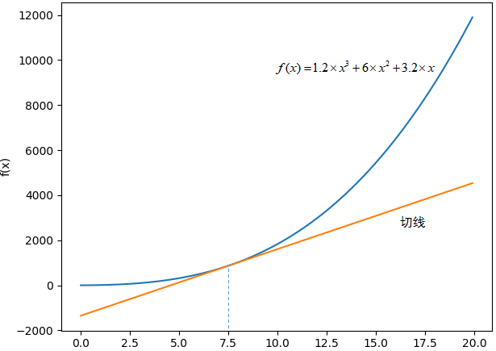
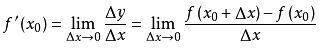
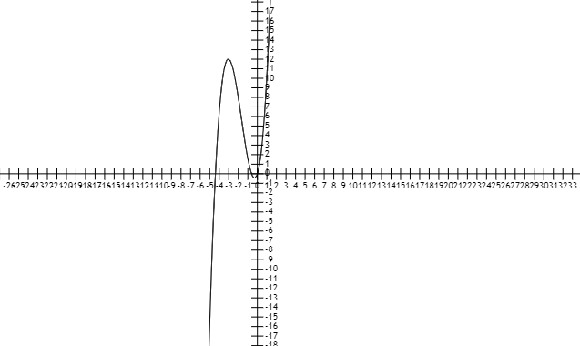
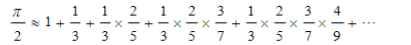
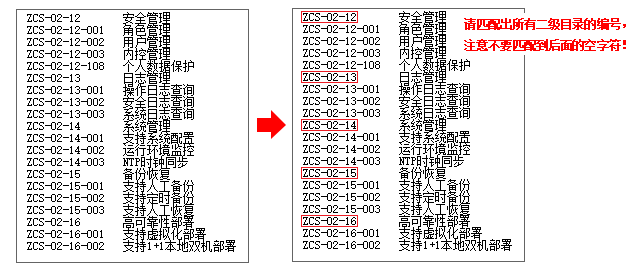

# 面试复盘第二篇
 [返回首页](../README.md)  
描述是1000-9999人的公司，第一次交流给的题很少只有4道机试题，但都不是那种常规题还蛮有意思的。    
# 目录
- [计算函数求导(函数式编程)](#计算函数求导)  
- [请根据公式求值(递归)](#请根据公式求值)  
- [统计出以下这段文字中出现频率最高的二元字符(时间复杂度)](#统计出以下这段文字中出现频率最高的二元字符)  
- [请用正则表达式匹配出所有二级目录的编号](#请用正则表达式匹配出所有二级目录的编号)
# 计算函数求导
求下图中f(x) 函数在x=7.5 时的导数。  
  
导数定义：  
设函数y=f（x）在点x0的某个邻域内有定义，当自变量x在x0处有增量Δx，（x0+Δx）也在该邻域内时，
相应地函数取得增量Δy=f（x0+Δx）-f（x0）；如果Δy与Δx之比当Δx→0时极限存在，则称函数y=f（x）在点x0处可导，
并称这个极限为函数y=f（x）在点x0处的导数记作：f’(x0)  
  
注意要求：  
不允许使用幂函数计算法,进行算术求解，算术求解直接判错。  
**注意不允许使用幂函数计算法,进行算术求解直接判错**  
我看到这句话还以为是不让使用求次幂的函数，上来就来了一次算术求解，交完题越想越亏。  
先放下答案，下面再一句一句讲解:  
[test_one_revenge.java](java/test_one_revenge.java)
```java
public class test_one_revenge {
    /**
     * 函数接口,传入要 求导的函数
     */
    interface Function {
        double accept(double value);
    }
    /**
     *  求导类
     */
    static class Derivatives{
        // 求导的函数
        private Function function;
        // 默认Δx无限趋近于0
        private static final double DELTA_X = 0.000001d;
        // 设置Δx
        private Double lim_x;
        public Derivatives(Function function) {
            this.function = function;
        }
        public Derivatives(Function function, Double lim_x) {
            this.function = function;
            this.lim_x = lim_x;
        }
        // 调用function中储存的函数accept进行求导，如果lim_x为null使用默认的无限趋近于0.
        public double derivation(double x) {
            if (lim_x == null) {
                return (function.accept(x + DELTA_X) - function.accept(x))/DELTA_X;
            } else {
                return (function.accept(x + lim_x) - function.accept(x))/lim_x;
            }
        }
    }
    public static void main(String[] args) {
        // 用我们需要的求导的函数创建一个Derivatives
        Derivatives derivatives = new Derivatives((x)->(1.2 * pow(x,3)) + (6 * pow( x,2)) + (3.2 * x));
        // 调用derivation求函数在x=7.5 时的导数
        System.out.println(derivatives.derivation(7.5d));
    }
    // 求幂
    public static double pow(double x, int y) {
        double i = 1.0d;
        while (y > 0) {
            if ( (y & 1) != 0) {
                i *= x;
            }
            x *= x;
            y >>= 1;
        }
        return i;
    }
}
```
先创建一个接口Function用于接收需要求导的函数，这个代码是基于jdk8的函数式编程，如果这方面有疑问还是先了解函数式编程
再来看这道题。  
再创建一个用于求导的累Derivatives，其中DELTA_X代表默认的趋近于0也就是求导中Δx->0这个部分。如果指的不是0是别的就需要设置lim_x。  
其中derivation方法就是用于求导了。  
```java
(function.accept(x + DELTA_X) - function.accept(x))/DELTA_X;
```
这段代码其实就对应着这个图：  
  
可以看到题目要求是f(x) 函数在x=7.5 时的导数：
```java
    public static void main(String[] args) {
        // 用我们需要的求导的函数创建一个Derivatives
        Derivatives derivatives = new Derivatives((x)->(1.2 * pow(x,3)) + (6 * pow( x,2)) + (3.2 * x));
        // 调用derivation求函数在x=7.5 时的导数
        System.out.println(derivatives.derivation(7.5d));
    }
```
所以我们用f(x)创建了一个Derivatives，然后调用derivation传入7.5就得到了我们的结果295.7000331207382。  
而这个pow方法就是我看错题目悲伤的产物了，这是一个使用位运算快速求幂的方法，由于和题目无关想要了解的可以自己查一下。  
复盘趣事：看看上面那个函数f(x)的图看着是一个很整洁弧线，而实际生成出来的图像是这样的:
  
# 请根据公式求值
请根据公式求解π的值，精确到小数点后精确到12位（向下取整，不四舍五入）。  
  
Java源码:  
[test_two.java](java/test_two.java)  
```java
import java.text.DecimalFormat;
public class test_two {
    public static void main (String[] args) {
        // 格式化
        DecimalFormat df = new DecimalFormat("#.############");
        System.out.println(df.format(test()));
    }
    public static double test() {
        return (1+recursion(1,1.0d))*2;
    }
    // 递归计算
    public static double recursion(int number, double n) {
        n =n* (number*1.0/(1.0+(number*2)));
        if (n <= 1e-12) {
            return n;
        }
        number++;
        return n + recursion(number,n);
    }
}
```
这个题主要就是找规律,简单的看一下表格:  

| 分子 | 分母 |  
| :-----:| :---: |  
| 1 | 3 |
| 2 | 5 |
| 3 | 7 |
| 4 | 9 |

就能得到代码里的这个部分  
```java
(number*1.0/(1.0+(number*2)))
```
因为只要精确到小数点后12位只要不断递归直到最后一个要加的部分小于等于1e-12(0.000000000001)  
最后将递归的部分全部相加再加上最初的1。  
还有别忘了乘以π的分母2。  
最后得到答案3.141592653589.  
# 统计出以下这段文字中出现频率最高的二元字符
请统计出以下这段文字中，出现频率最高的二元字符（两个字符）的组合。
oneofthecentralresultsofairesearchinthe1970swasthattoachievegoodperformanceaisystemsmusthavelargeamountsofknowledgeknowledgeispowertheslogangoeshumansclearlyusevastamountsofknowledgeandifaiistoachieveitslongtermgoalsaisystemsmustalsousevastamountssincehandcodinglargeamountsofknowledgeintoasystemisslowtediousanderrorpronemachinelearningtechniqueshavebeendevelopedtoautomaticallyacquireknowledgeoftenintheformofifthenrulesproductionsunfortunatelythishasoftenledtoautilityproblemminton1988bthelearninghascausedanoverallslowdowninthesystemforexampleinmanysystemslearnedrulesareusedtoreducethenumberofbasicstepsthesystemtakesinordertosolveproblemsbypruningthesystemssearchspaceforinstancebutinordertodetermineateachstepwhichrulesareapplicablethesystemmustmatchthemagainstitscurrentsituationusingcurrenttechniquesthematcherslowsdownasmoreandmorerulesareacquiredsoeachsteptakeslongerandlongerthisectcanoutweighthereductioninthenumberofstepstakensothatthenetresultisaslowdownthishasbeenobservedinseveralrecentsystemsminton1988aetzioni1990tambeetal1990cohen1990ofcoursetheproblemofslowdownfromincreasingmatchcostisnotrestrictedtosystemsinwhichthepurposeofrulesistoreducethenumberofproblemsolvingstepsasystemacquiringnewrulesforanypurposecanslowdowniftherulessignicantlyincreasethematchcostandintuitivelyoneexpectsthatthemoreproductionsthereareinasystemthehigherthetotalmatchcostwillbethethesisofthisresearchisthatwecansolvethisprobleminabroadclassofsystemsbyimprovingthematchalgorithmtheyuseinessenceouraimistoenablethescalingupofthenumberofrulesinproductionsystemsweadvancethestateoftheartinproductionmatchalgorithmsdevelopinganimprovedmatchalgorithmwhoseperformancescaleswellonasignicantlybroaderclassofsystemsthanexistingalgorithmsfurthermorewedemonstratethatbyusingthisimprovedmatchalgorithmwecanreduceoravoidtheutilityprobleminalargeclassofmachinelearningsystems  
（举例：在字符串“1252336528952”中，二元字符组合“52”出现3次，频率最高。）  
注意要求：本题考查对时间复杂度的充分优化，要求时间复杂度为n，而非n²。  
这个题目应该不是最优解，如果有更快的方法可以留言讨论。  
由于要求时间复杂度，我们就不能for循环直接暴力解了，这里我们用一下Java自带的集合:  
[test_three.java](java/test_three.java)
```java
public class test_three {
    public static void main(String[] args) {
        String str = "oneofthecentralresultsofairesearchinthe1970swasthattoachievegoodperformanceaisystemsmusthavelargeamountsofknowledgeknowledgeispowertheslogangoeshumansclearlyusevastamountsofknowledgeandifaiistoachieveitslongtermgoalsaisystemsmustalsousevastamountssincehandcodinglargeamountsofknowledgeintoasystemisslowtediousanderrorpronemachinelearningtechniqueshavebeendevelopedtoautomaticallyacquireknowledgeoftenintheformofifthenrulesproductionsunfortunatelythishasoftenledtoautilityproblemminton1988bthelearninghascausedanoverallslowdowninthesystemforexampleinmanysystemslearnedrulesareusedtoreducethenumberofbasicstepsthesystemtakesinordertosolveproblemsbypruningthesystemssearchspaceforinstancebutinordertodetermineateachstepwhichrulesareapplicablethesystemmustmatchthemagainstitscurrentsituationusingcurrenttechniquesthematcherslowsdownasmoreandmorerulesareacquiredsoeachsteptakeslongerandlongerthisectcanoutweighthereductioninthenumberofstepstakensothatthenetresultisaslowdownthishasbeenobservedinseveralrecentsystemsminton1988aetzioni1990tambeetal1990cohen1990ofcoursetheproblemofslowdownfromincreasingmatchcostisnotrestrictedtosystemsinwhichthepurposeofrulesistoreducethenumberofproblemsolvingstepsasystemacquiringnewrulesforanypurposecanslowdowniftherulessignicantlyincreasethematchcostandintuitivelyoneexpectsthatthemoreproductionsthereareinasystemthehigherthetotalmatchcostwillbethethesisofthisresearchisthatwecansolvethisprobleminabroadclassofsystemsbyimprovingthematchalgorithmtheyuseinessenceouraimistoenablethescalingupofthenumberofrulesinproductionsystemsweadvancethestateoftheartinproductionmatchalgorithmsdevelopinganimprovedmatchalgorithmwhoseperformancescaleswellonasignicantlybroaderclassofsystemsthanexistingalgorithmsfurthermorewedemonstratethatbyusingthisimprovedmatchalgorithmwecanreduceoravoidtheutilityprobleminalargeclassofmachinelearningsystems";
        Map<String, Integer> map = new TreeMap<String, Integer>();
        final int maxNum = 0;
        char[] ch = str.toCharArray();
        // 每两个
        for (int i = 0; i < ch.length - 1; i++) {
            map.put(ch[i] + "" + ch[i + 1], map.get(ch[i] + "" + ch[i + 1]) == null ? 1 : map.get(ch[i] + "" + ch[i + 1]) + 1);
        }
        int temp=0;
        String strMax="";
        System.out.println(str.length());
        for (Map.Entry<String, Integer> mapping : map.entrySet()) {
            if(temp<mapping.getValue()){
                temp= mapping.getValue();
                strMax= mapping.getKey();
            }
        }
        System.out.print("str:"+strMax + "\n出现" +temp +"次数");
    }
}
```
这里我们选择用Map，key储存两个字符的组合，value存出现的次数,每次得到字符组合的时候都到map里去取，
如果没有就写入一个1，如果有就在原本的值上+1。最后遍历Map获得出现的最多的组合。  
这里面使用TreeMap主要是想想试一下他的排序特性，但是感觉好像并没有起到太大的作用，因为并不知道最多的组合在自然序的哪个位置。
HashMap应该也可以。  
执行结果：  
```
str:th
出现53次数
```
# 请用正则表达式匹配出所有二级目录的编号
源文本摘自一个操作手册的目录，请用正则表达式匹配出所有二级目录的编号：  
  
正则表达式:  
```
ZCS-[0-9]*-[0-9]*(?=\s)
```
关键在于(?=\s)虽然会判断空格但是并不会把空格匹配进字符串，完成了不要匹配后面的空字符的要求。  